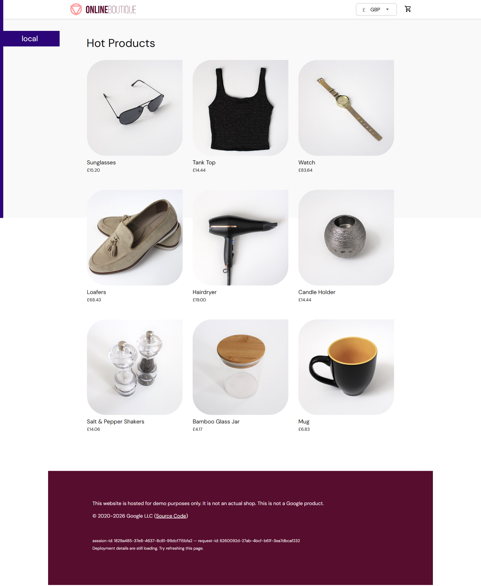
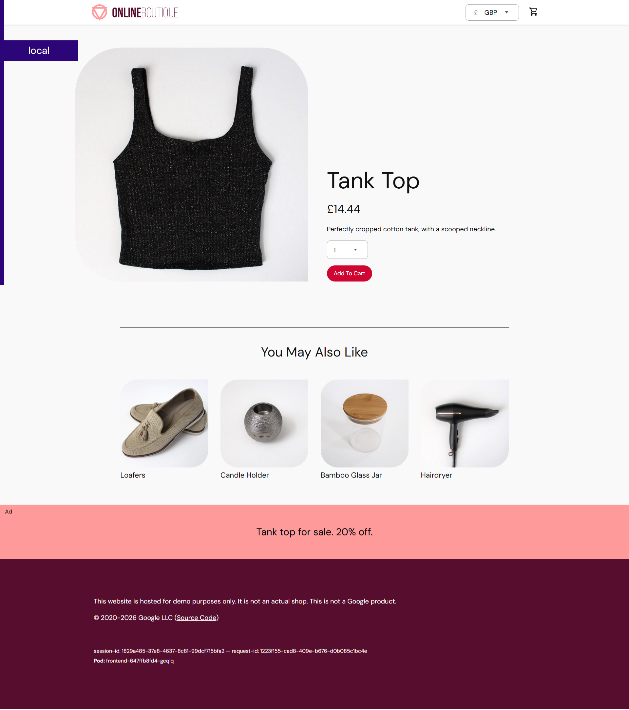
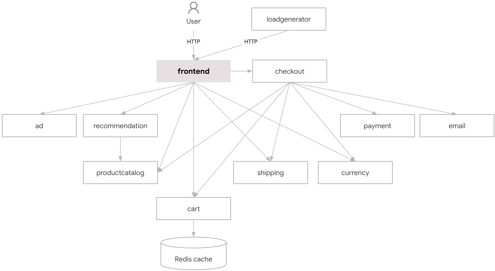

## ☸️📦 Microservices application deployment on Kubernetes Cluster

Deploy an online-shop microservices application on a Kubernetes cluster using Kustomize.

---

### 📌 Project Overview:

Online Boutique is a cloud-first microservices demo application. The application is a web-based e-commerce app where users can browse items, add them to the cart, and purchase them.
This project demonstrates how to deploy and run a microservices-based application on Kubernetes using production and security best practices.

---

### 🌐 Live Demo:




---

### 🏗️ Architecture:

Online Boutique is composed of 11 microservices written in different languages that talk to each other over gRPC.



---

### 🚀 Deployment Process:

As a DevOps Engineer, when you are given a task to deploy the microservices application on Kubernetes Cluster, You need to communicate with developers to understand the key information redarding microservices like:

1- Which microservices are being deployed?
2- Which microservices are connected with others?
3- What dependencies does each microservice have (e.g., databases or third-party services such as message brokers)?
4- Which microservice is accessible from outside the cluster?
5- On Which Port does each microservice run?

You don’t need to understand the internal code of each service—only how they interact and operate.

---

### ⚙️ Deploy Online Boutique with Kustomize

1. From the root folder of this repository, navigate to the `kustomize/` directory.

   ```bash
   cd kustomize/
   ```

1. See what the default Kustomize configuration defined by `kustomize/kustomization.yaml` will generate (without actually deploying them yet).

   ```bash
   kubectl kustomize .
   ```

1. Apply the default Kustomize configuration (`kustomize/kustomization.yaml`).

   ```bash
   kubectl apply -k .
   ```

1. Wait for all Pods to show `STATUS` of `Running`.

   ```bash
   kubectl get pods

   ```

---

### 🔐 Production & Securiy Best Practices:

- Specify a Pinned version for each container image
- Configure Liveness probe on each container
- Configure Readiness probe on each container
- Configure Resource Requests for each container
- Configure Resource Limits for each container
- Don't use Node Port service to expose application
- Explicitly specify more than 1 Replicas for deployment
- Use more than 1 worker nodes for your cluster
- Use namespace to isolate resources across teams and projects
- Ensure Images are free of vulnerabilities
- Don't run your containers with Root Access

---

### 🎯 Learning Objectives:

- Gain hands-on experience with core Kubernetes resources such as Deployments, Services, ConfigMaps, and Secrets.
- Apply production best practices, including resource limits, health checks (liveness/readiness probes), and secure configurations.
- Understand how to debug and monitor Kubernetes workloads using kubectl commands.
- Learn how to organize and manage Kubernetes manifests using Kustomize overlays and bases.

---

### 👨‍💻 Connect with me:

**Ibrar Munir**

Github: https://github.com/ibrarmunircoder </br>
LinkedIn: https://www.linkedin.com/in/ibrar-munir-53197a16b </br>
Portfolio: https://ibrarmunir.d3psh89dj43dt6.amplifyapp.com
